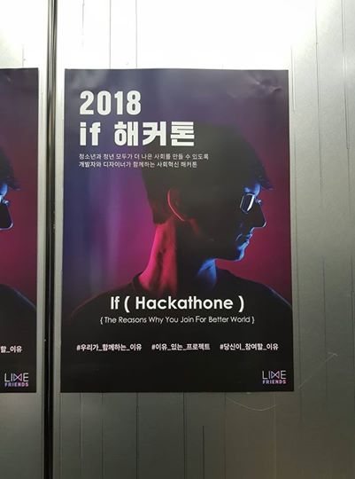

# Cause_Server
AWS directory : Cause_Servers_end/Nodejs_Server

## Technical Stack  
### Language  
* JavaScript (Node.js)  
### Database  
* MySQL  
### Cloud
* AWS Lightsail
### API DOCS
* Swagger
### Server
* MySQL Server  
* Android API Server

  
2018.11.10 ~ 2018.11.11 이틀간 사회혁신 if 해커톤에 팀 Phantom 으로 참가하였다.  
우리 팀은 대덕소프트웨어 마이스터고등학교 전공동아리 Phantom 5명과 선린고 한 분의 디자이너로 구성되었다.  
나는 우리 팀에서 백엔드 개발자를 맡게 되었다.

이번에 처음으로 서버개발자로서 해커톤에 나오게 되어 많이 긴장되었지만 그동안 공부했던 것들과 함께 참가한 선배의 조언이 많은 도움이 되었다.  
그동안 해커톤에서는 뭔가 제대로 만들어서 보여주기에는 짧은 시간이기 때문에 아이디어를 보여주는 중심으로 만들었는데, 이번 해커톤은 미리 여러번의 회의를 통해 기획이 끝난 상태로 참가하였기 때문에 바로 개발에 집중할 수 있었다.
  
이번 해커톤의 후원사로는 AWS 가 있었는데 따라서 서버를 올릴 때 AWS 를 써야 했다. 나는 학교에서 이전에 AWS에 서버를 올리려는 시도를 해 보았지만 학교망에서 클라우드를 모두 막아 실패했었다. 그래서 어쩔 수 없이 Heroku 를 썻었는데, 이번에 해커톤에서 AWS 를 배우면서 바로 적용하게 되었다. 사용한 서비스는 AWS Lightsail 이었다.  

해커톤에 가서 가장 먼저 한 일은 AWS 에 MySQL 서버를 만든 것이었다. AWS에 MySQL 서버를 만들고 내 컴퓨터와 같이 협업하는 선배가 MySQL WorkBench 를 통해 원격으로 DB에 접속할 수 있었다. 그렇게 DB 다이어그램을 만든 후 WorkBench로 실제로 만들었다. 하지만 나중에 데이터를 저장하는 과정에서 문제가 발생했는데, 한글 데이터를 저장하면 ???가 저장되었다. 이 문제는 MySQL 한글화를 설정해주지 않았기 때문에 발생했다. 하지만 이미 테이블간의 foreign key로 관계를 지정한 후라 설정을 적용하지 못했다. 그래서 결국 foreign key를 삭제하고 다시 설정후 만들었다. 다음 부터는 데이터에 한글 데이터가 들어갈 경우 한글화를 먼저 설정해주고 foreign key를 설정해야 겠다는 생각이 들었다.

본격적으로 서버를 짜기 전 API 문서를 짜게 되었다. 나는 그동안 API 문서는 API를 다 짜고나서 클라이언트에게 전달해줄려고 만들때만 사용해보았다. 하지만 이번에는 API를 짜기 전에 어떤 API를 만들지 문서로 구성한 후 그 문서에 따라 API를 짜게 되었다. 처음으로 만들어보는 API 문서였는데, 선배가 자기가 만들었던 API 문서예시를 보여주셔서 구조를 알게 되었다. 그런데 생각보다 요청값과 결과값까지 모두 정하는 작업이 어려웠다. API 문서를 제작하는 데만 4시간 가까이 소요되었다. 지루한 작업이라서 빨리 개발을 하고 싶었지만 선배가 이것이 가장 중요한 작업이고 이 작업또한 개발에 포함된다고 하셔서 꿋꿋히 했다. 선배가 한 번 완성해보면 다음부터는 빠르게 할 수 있을 것이라고 했다. 실제로 문서를 다 작성한 후 API를 짤 때 평소에 짜는 것보다 훨씬 적은 시간으로 만들 수 있었고 예상치못한 결과가 나오는 경우도 거의 없었다. 이제 API를 짤 때 시간이 충분히 있다면 API 문서를 먼저 짜야겠다.  

이제 우리가 만든 어플리케이션인 Cause 로 넘어가면 먼저 Cause 란 기존의 펀딩 클라우드 시스템에서 환급된 돈을 기부에 사용할 수 있는 시스템이다. 이미 유럽과 미국 등 선진국가 에서 시행중인 서비스로 우리나라도 이런 서비스가 사회적으로 긍정적인 영향 불러올 수 있을 것 같았다.
  
우리는 이번 if 해커톤에서 3등상인 후원사 특별상을 받았고 20만원도 얻게 되었다. 그다지 큰 상은 아니었지만 팀원 모두가 열심히 하여 성과를 만든 것에 의미가 있었다고 생각한다.  
     

아래는 우리가 이번에 만든 Cause의 프로토타입이다.  
 
 
 
 
